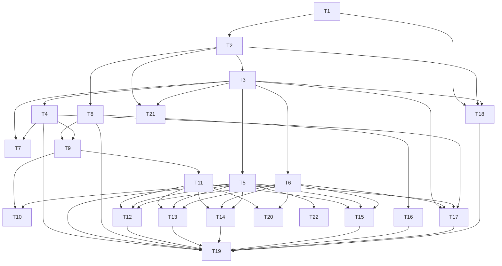

# Stage 3 · Atomize

## 1. 原子任务清单

| ID | 任务 | 说明 | 产出验收 |
| -- | ---- | ---- | -------- |
| T1 | 初始化仓库结构 | 建立 monorepo 目录、配置 package.json、workspace、基础脚本 | 前端/后端项目骨架可运行 |
| T2 | 通用配置与工具链 | 配置 TypeScript、ESLint、Prettier、Vitest、Husky、commitlint | `npm run lint`/`test` 可执行，CI 配置文件 |
| T3 | Backend 基础设施 | 构建 Express 服务器、环境加载、全局中间件、健康检查 | `/health` 返回 200 |
| T4 | 身份认证与用户服务 | 用户模型、注册登录、JWT/OAuth 框架、密码哈希、用户资料 API | 注册/登录/刷新接口通过测试 |
| T5 | 成绩与排行榜服务 | Score 模型、提交成绩、排行榜查询、Redis 缓存 | 成绩提交 & 榜单 API 可用 |
| T6 | WebSocket 实时服务 | Socket.IO 服务器、大厅/游戏命名空间、匹配逻辑骨架 | 客户端可建立连接、加入房间 |
| T7 | 管理员后台 API | Admin 角色鉴权、用户管理、统计接口、审计日志 | Admin API 返回期望数据 |
| T8 | 前端工程搭建 | Vite+React+TS 项目、路由、状态管理、UI 主题 | SPA 可启动、基础路由可达 |
| T9 | 前端认证 & 用户界面 | 登录/注册/OAuth UI、会话状态、个人中心、设置 | Auth 流程打通并自测 |
| T10 | 游戏大厅 & 排行榜界面 | 游戏列表、搜索、排行榜展示、响应式布局 | 大厅页面展示数据 |
| T11 | 游戏运行容器 | 通用 Canvas 容器、控制栏（暂停/重开）、输入映射、状态同步 | 可加载占位游戏运行 |
| T12 | 俄罗斯方块实现 | 完整逻辑 + 单人模式 + 同步钩子 | 本地游玩可行、成绩上报 |
| T13 | 贪吃蛇实现 | 同上 | 本地游玩可行、成绩上报 |
| T14 | 井字棋实现 | 单人（AI）+ 多人对战 | 可与另一个客户端对战 |
| T15 | 马里奥实现 | 基础关卡、碰撞、敌人、胜负判定 | Demo 关卡可玩、成绩 |
| T16 | 多语言与设置 | i18n 集成、语言切换、主题/音量设置 | UI 支持至少中英切换 |
| T17 | 安全与防作弊措施 | 速率限制、输入校验、作弊检测钩子、日志 | 安全测试脚本通过 |
| T18 | 部署与运维 | Docker Compose、环境示例、启动脚本 | `docker compose up` 成功启动所有服务 |
| T19 | 文档与测试覆盖 | API 文档、架构说明、游戏指南、测试编写 | 文档完成、测试覆盖率报告 |
| T20 | 实时大厅前端 | Socket.IO 客户端、匹配队列、实时状态提示 | 多客户端联调成功 |
| T21 | CI/CD 流水线 | GitHub Actions 流程、缓存、矩阵测试 | PR 自动运行 lint/test/build |
| T22 | 观测与告警 | OpenTelemetry 导出、Prometheus 指标、健康探针 | 指标可被外部采集系统抓取 |

## 2. 依赖关系（Mermaid）

## 3. 质量审核

- 任务粒度：所有任务可独立开发与测试，最长不超过 2-3 天工作量。
- 覆盖性：涵盖基础设施、核心功能、游戏模块、国际化、安全、部署与文档。
- 可追踪：每个任务对应至少一个验收标准，可在项目管理工具中建卡跟踪。
- 风险预案：高风险任务（T12-T15）依赖共享运行容器（T11）和实时服务（T6），需优先完成底层设施；并可在出现延迟时降级为“演示模式”。

---

> 本文档输出 Stage 3（Atomize），供后续审批与执行使用。
